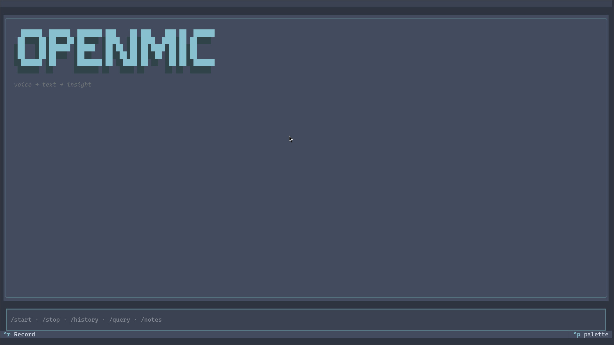
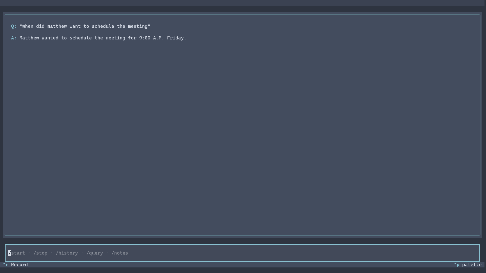
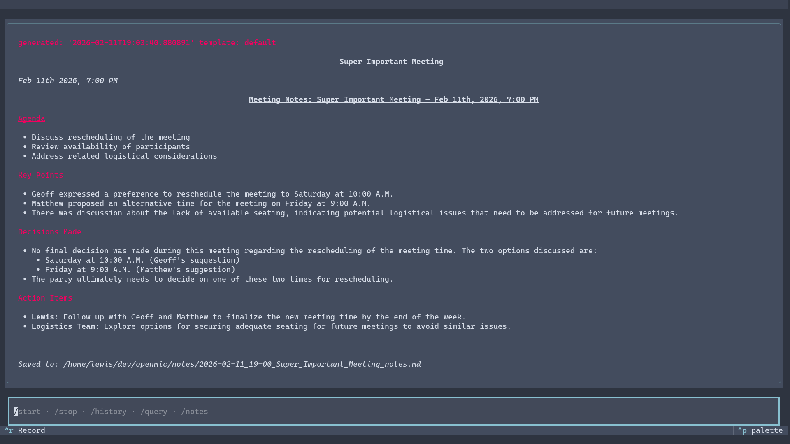

# OpenMic

[](https://www.python.org/downloads/)
[](https://github.com/anthropics/claude-code)
[](https://textual.textualize.io/)
[](#development)

> A beautiful CLI/TUI for meeting transcription with live preview, speaker diarization, and RAG-powered querying.

[Installation](#installation) • [Commands](#commands) • [Features](#features) • [Development](#development)

---

## What It Does

OpenMic is a terminal-based meeting transcription tool that:

- 🎤 **Records audio** from your microphone during meetings
- ⚡ **Streams live transcription** to your screen in real-time (via ElevenLabs Scribe)
- 👥 **Identifies speakers** automatically with diarization (Speaker 1, Speaker 2, etc.)
- 💾 **Saves transcripts** as markdown files with timestamps
- 🔍 **Answers questions** about past meetings using RAG (retrieval-augmented generation)
- 📝 **Generates meeting notes** with structured summaries, action items, and decisions
- 🎨 **Beautiful TUI** with themes, keyboard shortcuts, and an intuitive interface


*OpenMic's clean TUI interface with command input and help menu*

---

## Installation

### Prerequisites

- Python 3.12 or higher
- A microphone
- API keys (see [Configuration](#configuration))

### Setup

```bash
# Clone the repository
git clone https://github.com/fushipanda/openmic.git
cd openmic

# Create virtual environment
python -m venv venv
source venv/bin/activate  # On Windows: venv\Scripts\activate

# Install dependencies (choose your LLM provider)
pip install -e ".[anthropic]"  # For Claude (Anthropic)
# or
pip install -e ".[openai]"     # For GPT-4/3.5 (OpenAI)
```

---

## Configuration

### API Keys Required

OpenMic needs three API keys:

1. **ElevenLabs** - For audio transcription (realtime + batch)
2. **OpenAI** - For embeddings (RAG search) - *always required, even if using Claude*
3. **Anthropic OR OpenAI** - For LLM completions (answering queries, generating notes)

### Setup `.env`

```bash
cp .env.example .env
```

Edit `.env` with your keys:

```bash
# Required: Transcription service
ELEVENLABS_API_KEY=your_elevenlabs_api_key

# Required: Embeddings for RAG (always needed)
OPENAI_API_KEY=your_openai_api_key

# Required: LLM provider (choose one)
LLM_PROVIDER=anthropic  # or "openai"
ANTHROPIC_API_KEY=your_anthropic_api_key  # if using Claude
# OPENAI_API_KEY already set above for embeddings
```

> **Why OpenAI API key if using Claude?**
> Anthropic doesn't provide an embeddings API. OpenMic uses OpenAI embeddings for the RAG search feature (`/query` command), while using Claude (or GPT) for generating answers and notes.

---

## Usage

### Start the Application

```bash
openmic
```

### Quick Example Workflow

```bash
# Start recording a meeting
> /start standup

# [speak for 5 minutes... live transcript appears on screen]

# Stop and save (diarization runs automatically)
> /stop

# Ask a question about the meeting
> /query What action items were mentioned?

# Generate structured meeting notes
> /notes
```

---

## Commands

| Command | Description |
|---------|-------------|
| `/start [name]` | Start recording (optionally with session name) |
| `/stop [name]` | Stop recording and process with diarization |
| `/pause` | Pause recording (resume with `/start`) |
| `/history` | Browse saved transcripts in a date-grouped popup |
| `/transcript <n>` | View a specific transcript by number or name |
| `/query <question>` | Ask a question about a transcript (uses RAG) |
| `/notes` | Generate structured notes from a transcript |
| `/name <name>` | Rename the most recent transcript |
| `/help` | Show help popup with all commands and shortcuts |
| `/verbose` | Toggle debug output |
| `/exit` | Quit the application |

**Aliases**: `/transcripts`, `/history`, `/transcript` (no args) all open the transcript browser.

---

## Keyboard Shortcuts

| Shortcut | Action |
|----------|--------|
| `Ctrl+R` | Toggle recording / pause |
| `Ctrl+T` | Cycle through themes (OpenMic, Nord, etc.) |
| `Ctrl+?` | Show help popup |
| `Esc` | Return to home screen (when viewing transcript/notes) |
| `Tab` | Autocomplete commands |
| `Ctrl+C` | Quit application |

---

## Features

### 🎤 Live Transcription
Words appear on screen as you speak via ElevenLabs Scribe WebSocket streaming. Transcription flows naturally with automatic paragraph breaks based on voice activity detection.

### 👥 Speaker Diarization
When you stop recording, OpenMic processes the audio through ElevenLabs batch API with speaker diarization enabled. The final transcript includes speaker labels (Speaker 1, Speaker 2, etc.) automatically.

### 🔍 RAG-Powered Querying
Ask natural language questions about past meetings. OpenMic uses LangChain with FAISS vector search to find relevant transcript segments, then generates accurate answers using your chosen LLM.


*Ask questions about past meetings and get AI-powered answers*

### 📝 Structured Meeting Notes
Generate professional meeting notes with a single command. Choose from multiple templates:
- **Standard** - Comprehensive notes with agenda, discussion points, decisions, action items
- **Concise** - Brief summary focused on outcomes
- **Technical** - Code snippets, technical decisions, architecture discussions
- **Team Meeting** - Team updates, blockers, priorities
- **1:1** - Personal discussion points and follow-ups
- **Executive** - High-level strategic summary


*Auto-generated structured notes with agenda, decisions, and action items*

### ⏸️ Pause/Resume
Pause recording mid-meeting without ending the session. The audio file and WebSocket connection pause together, resuming seamlessly when you're ready.

### 📁 Transcript Browser
Browse all your saved transcripts in a beautiful modal popup, organized by date (Today, Yesterday, or formatted date). See at a glance which transcripts still need notes generated (starred indicators).

### 🎨 Themes
Switch between carefully designed dark themes with `Ctrl+T`:
- **OpenMic** - Custom theme with vibrant accents
- **Nord** - Arctic, north-bluish color palette
- Plus additional Textual built-in themes

### 📊 Session Tracking
Real-time display of API usage in the current session:
- Audio transcription time (ElevenLabs credits)
- LLM calls and token counts (Claude/GPT credits)

---

## File Storage

Transcripts and notes are saved as markdown files:

```
transcripts/
  ├── 2026-02-11_14-30.md              # Unnamed session
  ├── 2026-02-11_15-45_standup.md     # Named session
  └── ...

notes/
  ├── 2026-02-11_14-30_notes.md
  ├── 2026-02-11_15-45_standup_notes.md
  └── ...

recordings/
  └── [temporary .wav files, auto-cleaned]
```

All files use markdown format with frontmatter for metadata and easy readability.

---

## Architecture

### Data Flow

```
During session:
  Mic ──► WebSocket (Scribe realtime) ──► live text displayed in TUI
  Mic ──► local .wav file              ──► audio buffer on disk

On stop:
  .wav ──► Scribe batch API (diarize=True) ──► Speaker-labeled transcript
                                            ──► saved to transcripts/
                                            ──► displayed in TUI
                                            ──► .wav cleaned up

Post-session:
  /query ──► LangChain RAG over transcripts/ ──► answer in TUI
  /notes ──► LangChain summarization chain   ──► structured notes in notes/
```

### Module Layout

```
openmic/
├── app.py          # TUI entry point (Textual). All widgets and orchestration.
├── audio.py        # Mic capture via sounddevice. Writes 16kHz mono WAV.
├── transcribe.py   # ElevenLabs Scribe (WebSocket realtime + REST batch)
├── storage.py      # File I/O for transcripts/ and notes/ markdown files
├── rag.py          # LangChain RAG: FAISS vector store + RetrievalQA chain
├── notes.py        # LangChain summarization with template support
└── templates/      # Built-in note templates (markdown + YAML frontmatter)
```

See [Developer Guide](#developer-guide) below for detailed data flow diagrams.

---

## Requirements

- **Python 3.12+**
- **ElevenLabs API key** - For transcription (both realtime and batch)
- **OpenAI API key** - For embeddings (RAG search)
- **Anthropic or OpenAI API key** - For LLM completions (answers and notes)

---

## Development

### Running Tests

OpenMic includes a comprehensive test suite with **163 passing tests** covering:
- Storage operations (transcripts, notes, templates)
- Transcription parsing (diarization, error handling)
- RAG pipeline (vector search, LLM provider selection)
- Notes generation (template system, caching)

Install development dependencies:

```bash
pip install -e ".[dev,anthropic,openai]"
```

Run all tests:

```bash
pytest
```

Run with verbose output:

```bash
pytest -v
```

Run specific test file:

```bash
pytest tests/test_storage.py
pytest tests/test_rag.py
```

### Test Coverage

- `tests/test_storage.py` - Storage layer (13 tests)
- `tests/test_transcribe.py` - Transcription parsing (8 tests)
- `tests/test_rag.py` - RAG pipeline integration (11 tests)
- `tests/test_notes.py` - Notes generation (7 tests)
- `tests/test_templates.py` - Template system (8+ tests)
- `tests/test_app.py` - TUI components (many tests)

---

## Developer Guide

For detailed technical documentation, see the full data flow and architecture diagrams in the code comments. Key highlights:

### Data Flow Details

```
/start
  app._start_recording()
    ├── audio.AudioRecorder.start()          → opens mic stream
    └── transcribe.RealtimeTranscriber.connect() → WebSocket to ElevenLabs

  [while recording]
    audio callback → transcribe.send_audio_chunk() → live text updates

/stop
  app._stop_recording()
    ├── audio.AudioRecorder.stop()           → saves .wav file
    ├── transcribe.RealtimeTranscriber.disconnect()
    └── app._run_batch_transcription(wav_path)
          ├── transcribe.BatchTranscriber.transcribe_file()
          ├── transcribe.parse_diarized_result()
          ├── storage.save_transcript()
          ├── app._display_diarized_transcript()
          └── cleanup .wav

/query <question>
  app._run_query()
    └── rag.TranscriptRAG.query()
          ├── FAISS vector search over transcript chunks
          └── LLM generates answer from relevant context

/notes
  app._generate_notes()
    └── notes.generate_meeting_notes()
          ├── Template selection (if first time)
          ├── LLM summarization with template prompt
          └── storage.save_notes()
```

### Known Limitations

- **Embeddings always use OpenAI** - Anthropic doesn't provide embeddings API
- **Vector store is in-memory** - FAISS index rebuilt each session (not persisted)
- **LangChain deprecations** - `LLMChain` and `chain.run()` are deprecated in newer versions
- **No real-time streaming to WebSocket yet** - Live preview is a stub (batch transcription works)

### Extending

**Swap vector store**: Replace `FAISS` in `rag.py` with ChromaDB or Pinecone—the rest is abstracted.

**Swap LLM provider**: Add a branch in `rag.get_llm()` and install the matching `langchain-<provider>` package.

**Add new note templates**: Create markdown files in `~/.config/openmic/templates/` with YAML frontmatter.

---

## Platform Support

| OS | Status | Notes |
|----|----|-------|
| **Linux** | ✅ Fully supported | Tested on Arch Linux |
| **macOS** | ✅ Should work | Intel & Apple Silicon (untested) |
| **Windows** | ✅ Should work | Use PowerShell or Git Bash (untested) |

---

## How This Was Built

I built OpenMic by looping [Claude Code](https://github.com/anthropics/claude-code) — giving it a feature list and bugs to fix in [CLAUDE.md](./CLAUDE.md), then iterating: Claude would implement a todo, I'd review it, and once tested it got pushed. The whole thing, from an empty directory to the current state (architecture, 163 tests, 50+ commits, this README), came out of that process. It's still a work in progress, but genuinely useful for what it does.

The workflow is called Ralph Loop — Claude Code's agentic mode where it works through tasks continuously based on your feedback. If you're curious about the full history, [CLAUDE.md](./CLAUDE.md) has the complete TODO list and every decision made along the way.

I use this daily for recording meetings — I've found myself enjoying a terminal-based workflow and wanted a transcription tool built on architecture I'm familiar with. Inspired in part by TUIs I've worked with recently, primarily [OpenCode](https://github.com/anomalyco/opencode/).

---

## Acknowledgments

- **[Claude Code](https://github.com/anthropics/claude-code)** - Used to build this project iteratively
- **Textual** - Excellent TUI framework by [Textualize](https://www.textualize.io/)
- **ElevenLabs Scribe** - High-quality audio transcription with diarization
- **LangChain** - Flexible framework for RAG and LLM chains
- **OpenAI & Anthropic** - Embeddings and LLM APIs

---

## License

MIT License - See [LICENSE](./LICENSE) file for details.

---

## Learn More

- **See the development process**: [CLAUDE.md](./CLAUDE.md) - Complete TODO history and architecture decisions
- **Read the code**: All modules are documented with clear data flow and extension points
- **Run the tests**: 163 automated tests demonstrate usage patterns
